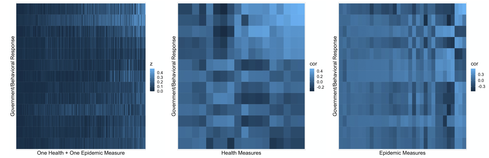
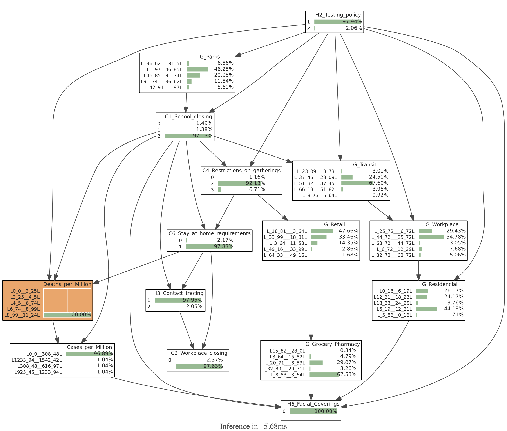
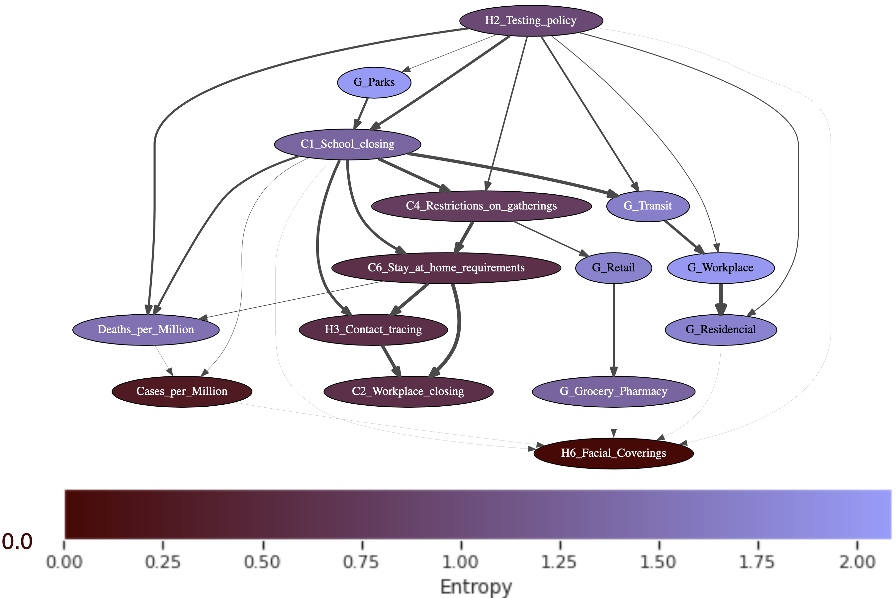
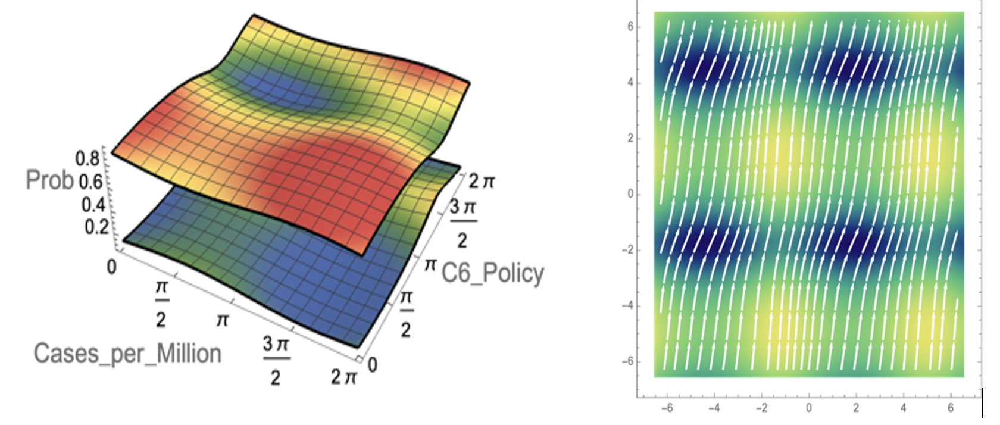
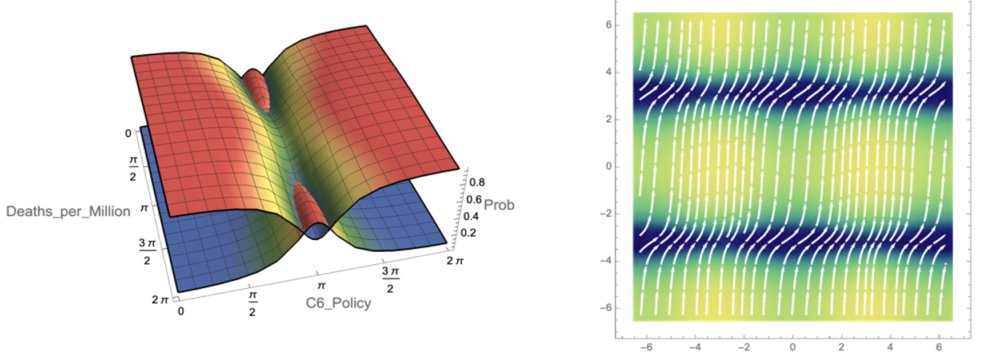
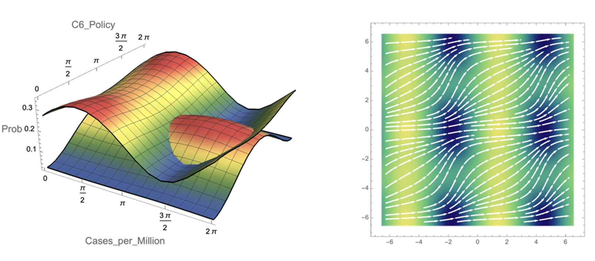

# c3.AI COVID-19 Challenge
# TEAM: QuLBIT

## Summary

This project complements the C3.ai COVID-19 data-lake with a domain-independent, highly scalable, Complex Event Processing architecture, suitable for cloud-based, serverless processing, able to continuously monitor event lake changes and generate new (complex) events based on existing ones. It also proposes advanced data analytics based on quantum-like probability theory to infer/predict the rationality of government responses.
The suggested architecture can promote flexibility by increasing the speed of the generation of new models. The quantum-based approach provides new explorative analytical methods that have the potential to identify biases in decision models.

## A Complex Event Process Architecture

We propose a domain-independent Complex Event Processing (CEP) architecture (Figure 2). Our event types are combinations of object types (like “country”) and measures, and are managed in an event type (metadata) repository. The result of this abstraction step are abstract and domain-independent event stream files, changes to which automatically trigger anonymous and anonymous CEP functions generating complex events (such as ratios).
A continuous sampling process draws samples from the event lake, matching event types that are compatible and events recorded at the same time; these state/output samples are used for hypothesis generation (data mining) and model testing. The model generation and testing results and the respective quality criteria (e.g. correlation of predicted and test values) are stored in specific event types to be reported to users.

	

Classical and Quantum-Like Inference enables the analysis and identification of biased and (ir)rational government responses through the formalisms of quantum mechanics. Uncertainty can cause decision-makers to deviate from the normative (rational) setting. This is due to quantum interference effects. Identifying these decisions can reduce policies that might put minority groups at risk. Figure 1 exemplifies quantum interference effects showing a decision process, where two ambiguous beliefs are co-occurring in the decision-maker’s mind, generating quantum interference effects that may lead to biases.

	

## Classical Analysis

The proposed architecture enables fast statistical evaluation of events according to different metrics.

	

## Bayesian Network Analysis

We used Bayesian networks (BNs) to learn insights regarding the (ir)rationality of government responses. Our analysis compared Sweden and Australia in different government responses. 

	
	

## Quantum-Like Bayesian Network Analysis

Quantum-Like Bayesian networks models events as waves. During inference, these waves crash with each other leading to deviations from the classical probability. These models may bring the data analyst insights about the (ir)rationality of decision processes.

	

